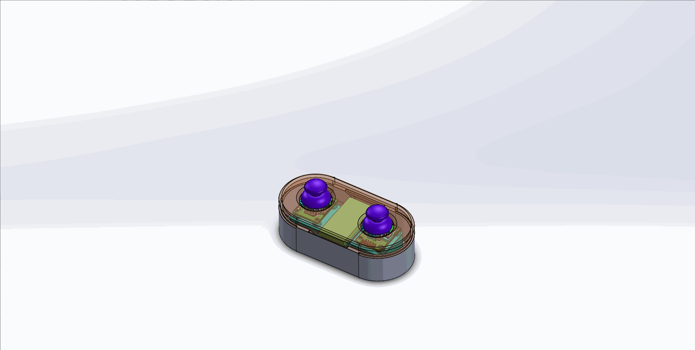
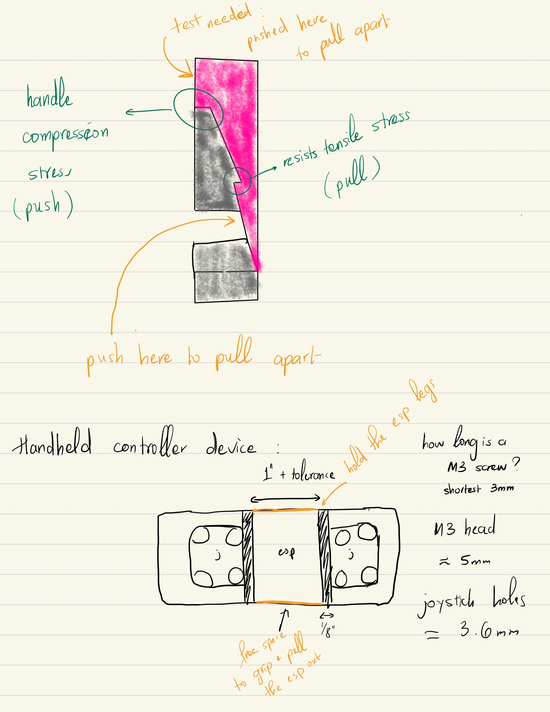

# Trashbot — Portfolio Documentation

---

## The Origin Story

Inspired by a philosopher I found on the internet, "make something out of your pain", I decided to end my long-term relationship with the one task nobody enjoys: taking out the trash.

The pains stacked up fast: the bin is dirty, Arizona summers make stepping outside miserable at any hour, and there's a narrow weekly window to get the bin to the curb and back before the HOA fines you. Miss it once and trash piles up. Miss it twice and you're sorting recycling by hand in 110°F heat.

Thus, the solutions:
Phase 1 removes the friction: a motorized platform that carries the trashbin, controlled by a handheld RF remote. Drive it from the backyard to the curb and back without ever touching it, or even stepping outside. Low enough friction that anyone in the household will actually do it.

Phase 2 removes the task entirely: a fully autonomous robot that handles pickup day on its own. No reminders, no scheduling, no human input.

---

## Concept Design
#### Three approaches

**Idea #1: Replace the bin's wheels with motor wheels (Eliminated)**

The bin's existing wheel geometry makes finding compatible motorized wheels difficult. Beyond fit, mounting anything directly to the bin creates a chain of problems: permanent damage to the bin, difficult maintenance, and the risk of leaking waste water into the hardware. The bin also has almost no clearance underneath for controllers and battery, and charging becomes awkward given the bin's size. In Arizona, any electronics mounted on the side staying outside all day would have little to no protection from summer heat.

→ Clear blockers and thus, eliminated.

**Idea #2: Separate carrier motorized platform (Selected)**

Instead of modifying the bin, build a platform the bin sits on top of. The platform approach solves most of Idea #1's problems at once: the platform can be sized with as much clearance as needed for components, and that clearance also shields electronics from heat, rain, and rough terrain. More importantly, it cleanly separates the automated system from the garbage bin so the bin stays a bin - easy to wash, easy to replace, no hardware attached to it.

It's worth noting this design assumes a garbage collection setup where the worker lifts the bag out of the bin manually. In neighborhoods where the truck uses a robotic arm to lift and dump the entire bin, Idea #3 would be more suitable.

→ My neighborhood uses manual collection, so the rest of this documentation will further demonstrate the build details of this design concept.

**Idea #3: Small robot that hooks onto the back of the bin and pulls it (On the shelf)**

Similar advantages to Idea #2 in terms of keeping hardware separate from the bin. The challenge is stability: rough terrain makes a trailing-pull/push configuration hard to control. Even manually pulling my bin across my own pavement showed how easily it can tilt or tip over. This idea is worth revisiting if incorporating an automatic gate-opener to handle the yard gate as part of the same trip becomes a requirement, and there's no clean way to integrate it into the platform design.

→ A valid approach - just not for my driveway.

---

### Mechanical Designs

The system has two main parts: a motorized platform and a handheld controller.

The platform carries the bin — two motor wheels on the sides, one caster wheel in front for turning, and electronics mounted underneath. The handheld controller houses an ESP32, two joysticks, and a battery pack inside a 3D-printed enclosure.

#### Platform

**Motor wheels**

Repurposed from a used hoverboard purchased at Goodwill for $2. Hoverboards are frequently donated because of dead batteries while the motors remain fully functional. Three quick checks before committing: battery confirmed dead via multimeter, hall sensors confirmed working by manually spinning the wheels and feeling the expected magnetic resistance, bench test with a spare ~24V battery confirmed the motors spun correctly under power.

The hoverboard yielded two brushless hub motors, two motor controllers (not reused — see Electronics), a wiring harness, and the metal mounting plates used in the cube assembly.

**Chassis**

Built around a 24-inch round pine board — purchased for under $10 as a slightly imperfect board. The round shape distributes weight evenly and gives natural clearance on all sides for the wheel assemblies. Everything else was sized around it.

**Caster wheel**

The caster wheel was selected before anything was designed in SolidWorks — a deliberate sequencing choice. Its height sets the ground clearance, which in turn determines how tall the 3D-printed adapter cubes need to be for the motor wheels. Getting this number wrong early would cascade through the rest of the build.

A 6-inch caster with a rounded-profile edge was selected. The profile choice came from a simple test at the hardware store: physically rolling both rounded and flat-edge casters across the concrete floor. The rounded edge had noticeably lower rolling resistance — relevant for a driveway surface. The 6-inch height provides enough clearance for the electronics mounted underneath and enough rollover ability for cracks and surface irregularities.

**3D Printed Adapter Cubes**

The hoverboard motor wheels have a small hollow metal tube at their center where the wires exit. The stock mounting hardware doesn't sit flat against a wooden platform, and the motor wheels needed to match the caster wheel's height exactly for the platform to sit level under a heavy, top-heavy load.

The solution was custom adapter cubes, designed in SolidWorks and 3D printed. Each cube:

- Has a half-cylinder cutout on top for the wheel's metal tube to rest in
- Matches the footprint of the hoverboard's metal mounting plate
- Has four holes aligned to the plate's four screw holes

Long screws and spacers run through the platform board, the cube, and the metal plate, clamping everything together as a single rigid assembly. The cubes were printed solid — no hollow fill — to eliminate any risk of cracking under load.

The assembly sequence:

1. Select and purchase the 6-inch caster wheel
2. Mount it to the platform and measure the resulting ground-to-platform height
3. Measure the height of the hoverboard motor wheel assemblies
4. Calculate the adapter cube dimensions needed to bring the motor wheels up to the same height
5. Design the cubes in SolidWorks, print, and assemble

#### Handheld Controller

The controller was designed in SolidWorks using two features heavily: Configurations to explore multiple dimension variations without maintaining separate files, and Design in Assembly to position the internal components — two joysticks, a battery pack, and an ESP32 — before designing the housing around them. Cost and material weight were evaluated by importing each design into 3D printing software. Ease of assembly and disassembly became the primary focus from Design #2 onward.

**Design #1**

Most of the time went into learning how to work effectively in SolidWorks assembly mode — reorienting components is time-consuming when design intent isn't established upfront. That lesson shaped how Design #2 was approached. The design was eliminated after importing into 3D printing software: the material cost came out to [placeholder] grams, and a clearer idea for reducing the size for better grip emerged.

**Design #2**

The battery pack was reoriented and component spacing was significantly reduced. The two separate poles from Design #1 were consolidated into a single center bridge, which holds the battery pack in place while connecting the joysticks and ESP32 on either side. The ESP32 dev board enclosure was removed — only the main board is mounted, reducing bulk.

The first print needed minor adjustments, but rather than re-printing immediately, hot glue was used to secure the joysticks and save prototyping time. The tight tolerances of the printed parts keep everything else in place with minimal movement. Assembly and disassembly are quick.

**Design #3**

Introduced snap-fit connections for cleaner assembly without fasteners. The first snap-fit worked, but thin snap-fit features are prone to bending during the print process — a known challenge with FDM printing. Multiple iterations of the snap geometry will need to be tested before the fit is reliable.

---

## Software

### Nvim Environment

Arduino IDE was the obvious starting point, but early on everything moved to Neovim as the single development environment for the project. The motivation was consistency: rather than context-switching between Arduino IDE for firmware, a text editor for notes, and something else for documentation, Neovim handles all of it. The learning curve was real, but the payoff was a deeper understanding of the underlying toolchain — compilers, serial monitors, LSP, build systems — rather than just clicking buttons in a GUI.

The bridge between Neovim and the Arduino ecosystem is `arduino-cli`, a command-line tool that handles everything Arduino IDE does through a GUI. Key commands:

- `arduino-cli board list` — find connected boards and their ports
- `arduino-cli compile --fqbn <board>` — compile the sketch
- `arduino-cli upload -p <port> --fqbn <board>` — upload to a board
- Compile once, upload to multiple boards with different `-p` flags — useful for flashing master and slave ESP32s separately
- `sketch.yaml` with the correct `default_fqbn` is required for LSP to work in Neovim
- `arduino-cli monitor -p <port> --config 115200` — open the serial monitor

---

### GitHub

*[Placeholder — code, schematics, and project files will be linked here.]*

---

## Electronics

### Basics

*[Placeholder — expand with fundamentals covered during the project: PWM, motor control logic, ADC, voltage levels, etc.]*

### Unit Tests

The approach mirrors software unit testing: isolate the smallest possible piece of behavior, verify it works, then build up. The small-scale test rig — DC motor, H-bridge, joystick, and ESP32 — was the physical embodiment of that: one input, one output, controlled conditions.

*[Placeholder — expand with specific test cases, test code structure, and how tests were organized as the project scaled up]*

### Procurement

| Component | Source | Cost | Notes |
|---|---|---|---|
| Hoverboard (motors + wiring) | Goodwill | $2 | Dead battery, working motors |
| ESP32 dev boards (x3) | Amazon | ~$25–30 | Dev boards with breakout pins for prototyping |
| Motor controllers ZS-X11HV2 (x2, then x2 more) | Amazon | ~$25 first set, ~$27 second set | First set: one burnt due to ESP8266 wiring issue |
| 6-inch caster wheel | Ace Hardware | ~$8–10 | Rounded profile, selected in-store |
| 24-inch round pine board | Hardware store | <$10 | Slightly imperfect board, discounted |

**On the hoverboard motor controllers:** The hoverboard came with its own controllers, but they weren't reused. Hoverboard controllers run proprietary firmware with no accessible reprogramming path — reverse-engineering would mean cracking encrypted firmware or finding undocumented protocols. Off-the-shelf brushless controllers (ZS-X11HV2, 6–60V, 400W) were purchased instead for ~$25, giving full control over motor behavior through clean, documented PWM inputs.

### Protocol: ESP-NOW

ESP-NOW was chosen as the wireless protocol between the handheld controller and the platform. The decision was straightforward — it's built directly into the ESP32, so no additional hardware, modules, or cost. Key reasons:

- Built into the ESP32 — no extra hardware needed
- Direct board-to-board communication — no router, no WiFi network dependency
- Range of 10+ meters comfortably covers the distance from a front door to the curb
- Low latency — 20ms packet intervals is more than sufficient for real-time motor control
- Well-documented with real-world community examples in similar projects
- Supports two-way and one-to-many topologies — useful headroom for Phase 2 without a protocol change

### Testing Log

Each component was validated in isolation before being integrated. The small-scale test rig used to validate motor control logic and wireless communication before touching the hoverboard motors:

- 1x ESP32 dev board
- 1x small Arduino DC motor
- 1x H-bridge motor driver
- 1x KY-023 joystick module

---

#### Session Notes:

**1. Joystick wiring bug (fixed)**

One joystick axis wasn't reading correctly. Initially suspected the module itself and tried splitting X and Y across two joysticks — problem persisted. Used a multimeter to check Y pin voltage while moving the X axis; it was changing when it shouldn't. Traced it to the Vcc pin wired to 5V instead of 3.3V. Lesson: check the datasheet for voltage requirements before wiring.

**2. ESP-NOW between two ESP32 boards**

Successfully sent joystick data wirelessly using ESP-NOW. Key learnings:
- Used `memcpy()` to unpack received data bytes back into a struct
- Sending every 20ms (50 packets/second) is more than enough for smooth motor control
- ESP-NOW uses the WiFi radio but doesn't need a router — direct board-to-board
- Both boards must be on the same WiFi channel — used NetSpot to find the least congested channel
- Master needs the slave's MAC address; slave just listens
- Max payload is 250 bytes per packet — joystick X/Y via `uint16_t` is 4 bytes total
- `uint16_t` (2 bytes, 0–65535) is the right type for 12-bit ADC values (0–4095)

**3. Joystick to motor control logic**

X axis controls direction, Y axis controls speed and forward/reverse. Key learnings:
- Deadzone of ~40–60 (on a 0–100 mapped scale) prevents motor twitching at idle
- `map()` with a flipped output range handles reverse speed correctly
- Cannot pass `y=0` to `set_speed()` — it triggers full reverse. Use `ledcWrite(speedPin, 0)` directly to stop
- PWM resolution set to 16-bit (0–65535) — a software configuration, not a hardware ceiling
- ADC2 pins are unsafe with any wireless protocol active — use ADC1 pins (GPIO 32–39) for analog reads

**4. C/C++ concepts refreshed**
- `&var` gets the address, `*ptr` dereferences it
- Arrays decay to pointers when passed to functions
- `(uint8_t*)&myStruct` — `&` gets the address, `(uint8_t*)` casts it so ESP-NOW can treat it as raw bytes
- Struct variables declared inside a function are local scope — declare at top level if needed across functions
- `map()` at global scope runs before Arduino initializes — assign inside `setup()`
- Forward declarations let you define functions after they're called
- `sizeof()` returns the byte size of any variable or type

**5. Switched from H-bridge to brushless motor controllers**

Moved from the small test H-bridge to the real motor controllers (ZS-X11HV2, 6–60V, 400W).

Key specs:
- PWM input range: 2.5–5V amplitude, 50Hz–20kHz frequency
- Direction control: LOW level is active (REVERSE_ON = LOW, REVERSE_OFF = HIGH)
- Brake: HIGH level active

**6. The Burnt Motor Controller**

Before the ESP32 unit test phase, an earlier attempt used a modified ESP8266 borrowed from a previous project. The board had pins pre-connected internally — a modification that wasn't visually obvious. The wrong pins were bridged during wiring, which sent bad signals to the motor controller and burnt it out.

The debug process:
1. Loaded the program — wheel didn't respond as expected
2. Stripped the code down to minimal unit tests — still no correct response
3. Researched the controller specs — found the stop pin on these controllers doesn't work as documented. No clear datasheet available. Dropped the stop function, used brake instead — which works fine
4. Used a multimeter to verify each pin's voltage output against the program
5. Checked continuity — found the pre-existing internal connections on the ESP8266 causing the incorrect wiring

After this, the ESP8266 was retired. The ESP32 was the replacement — newer, more capable, and unmodified. Three dev boards were purchased from Amazon with breakout headers for easy prototyping.

---

### Tools: KiCad + Wiring Diagram

*[Placeholder — full schematic, KiCad screenshots, and wiring diagram. Connect to motor controller specs and ESP32 pin assignments above.]*

---

---

## Project Management

### Objectives

Phase 1 is deliberately narrow: a remote-controlled carrier that moves the trashcan from backyard to curb and back without the user ever touching it. No automation, no scheduling, no sensors — just reliable, controllable movement. Once that's proven, Phase 2 builds on top.

Phase 2 is full automation — the carrier handles pickup day on its own. It knows the schedule, makes the trip, and brings the bin back in without any human input.

---

### Timeline

**Phase 1: February 2026 – April 2026** (approx. 3 months, part-time)
- Month 1: Research, component sourcing, procurement, returns/exchanges, and lead time
- Month 2: Design, build, and testing
- Month 3: Documentation, demos, and polish

**Phase 2: May 2026 – July 2026** (approx. 3 months, part-time)
- Same breakdown: research → build → document

---

### Budget

Target for Phase 1: **~$150**

Major cost drivers:
- Battery: ~$60
- ESP32 dev boards: ~$25–30 for 3–4 boards
- Motor controllers (ZS-X11HV2): ~$20–25

The rest covers the platform, caster wheel, 3D printing filament, screws, spacers, and wiring. Sourcing smart — Goodwill for the hoverboard at $2 — kept costs down where it didn't matter.

---

### Quality Evaluations

*[Placeholder — testing criteria, pass/fail metrics, and demo results]*

---

## Demos

*[Placeholder — build progress photos, assembly images, and demo videos to be added once Phase 1 is complete]*

---

## Phase 2: Gate Opener / Automated System

*[Placeholder — to be written after Phase 1 is complete]*
