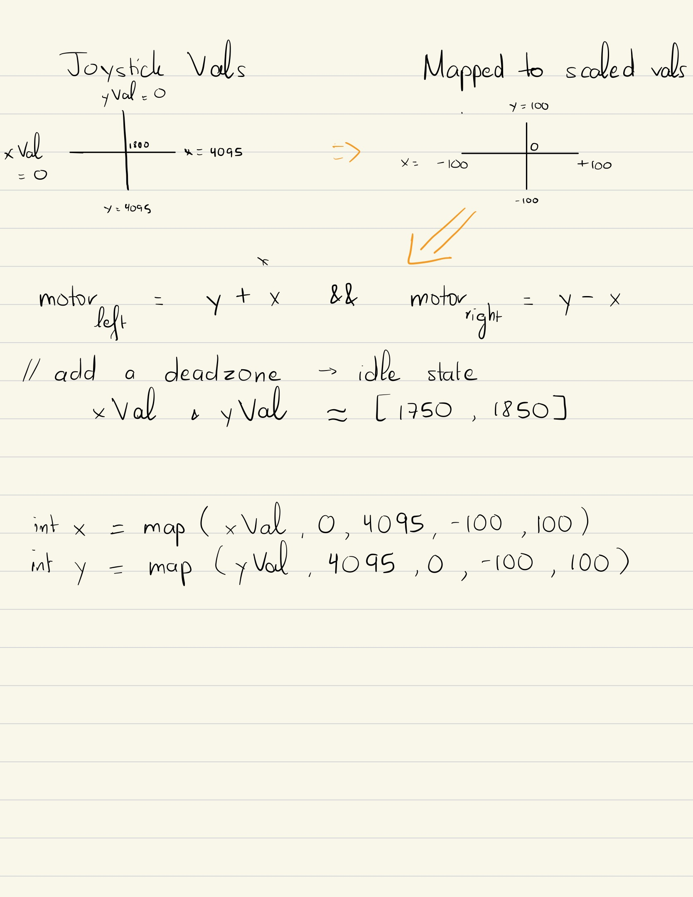
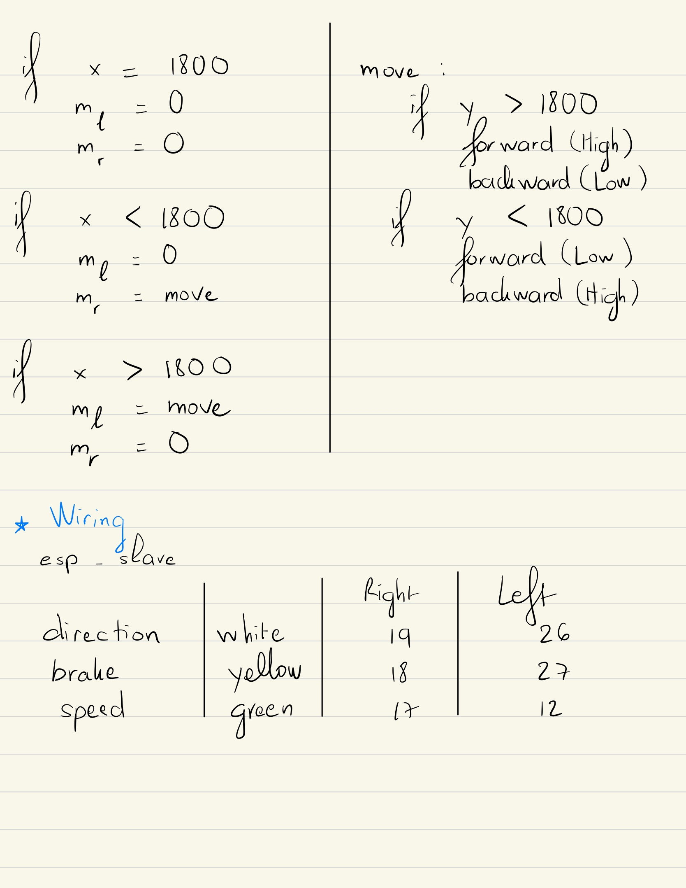
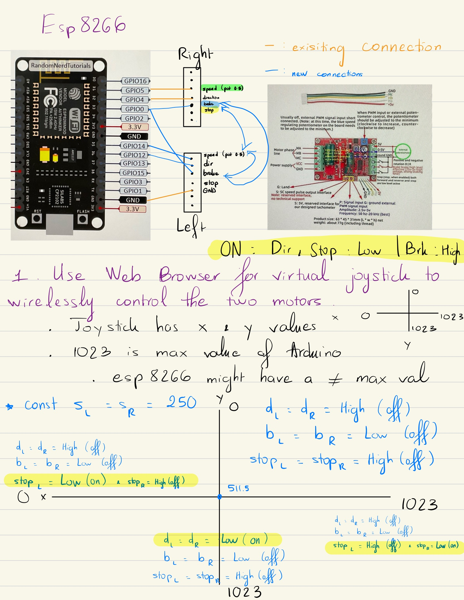
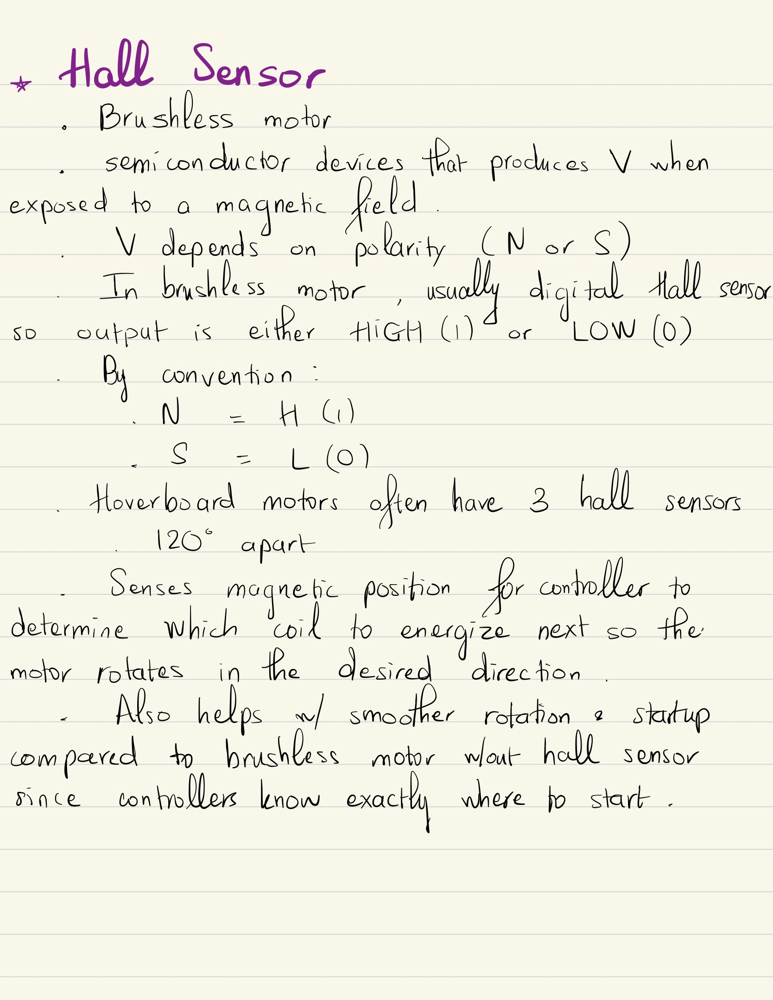
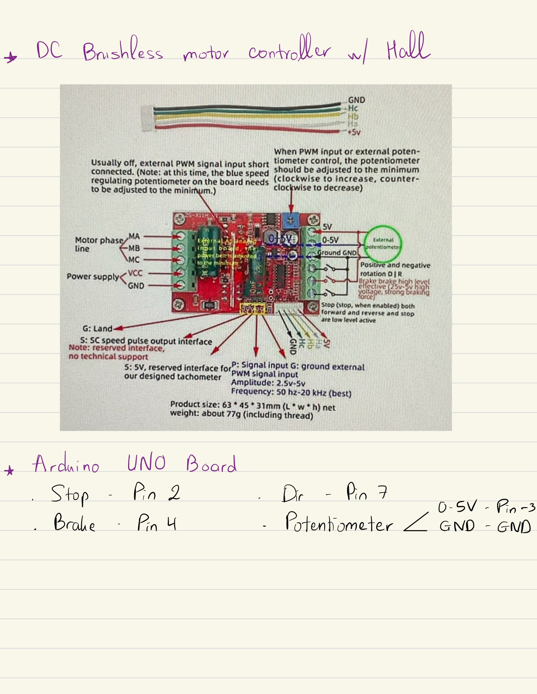
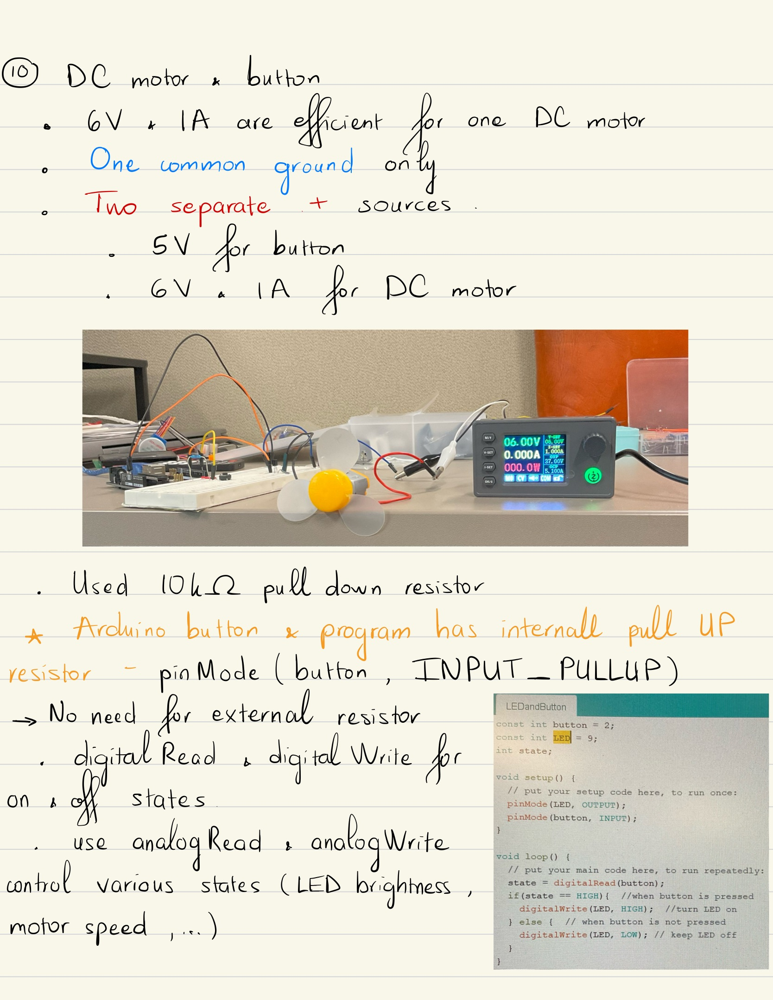
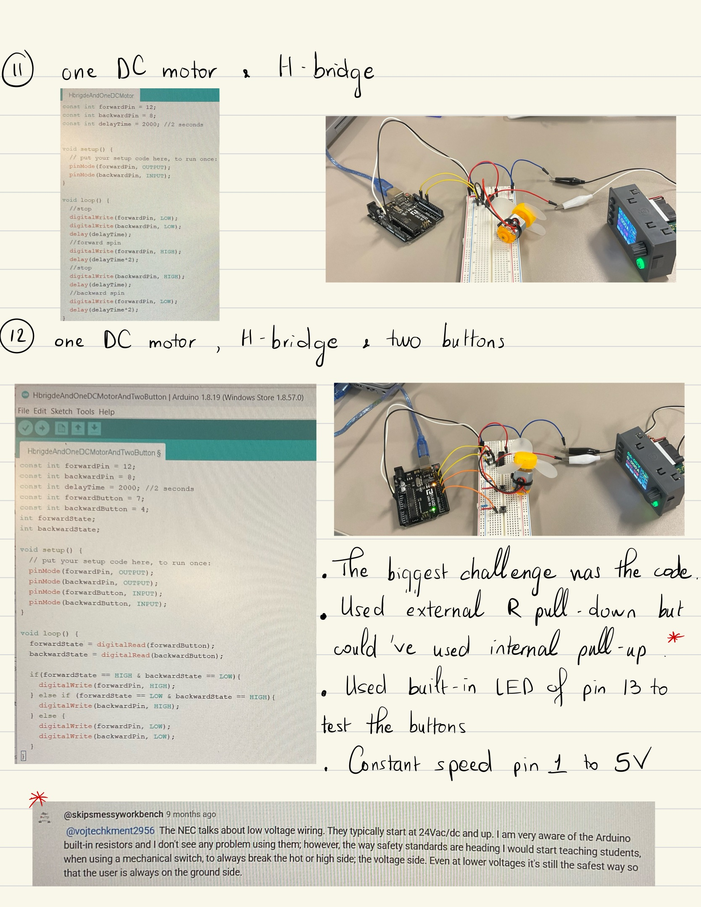
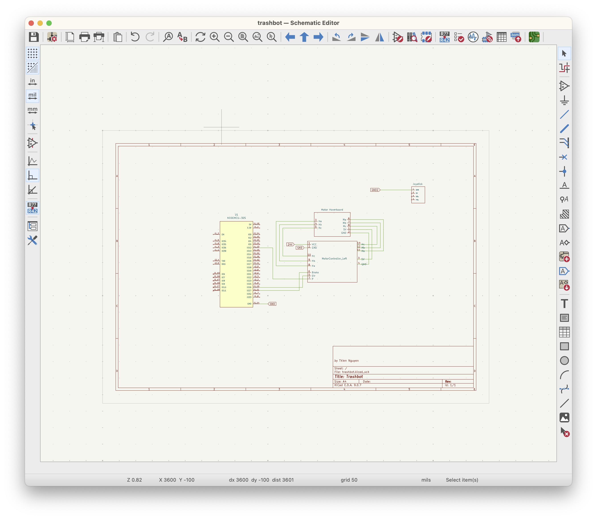

## The Story

I don't like memorizing garbage pickup dates nor taking the bin out (and back in) multiple times per week so I am building a self-driving robot to do it for me. I split the project into two phases:
- Phase 1: Motorized platform carries the bin, controlled by a handheld RF remote.
- Phase 2: Fully autonomous on a programmed schedule. No human input.

---

## Video Demo

*[Coming soon]*

---

## Concept Design - 3 approaches

**Idea #1: Replace the bin's wheels with motor wheels (Eliminated)**

Incompatible wheel geometry, almost no clearance underneath, and no good place to mount electronics. Anything attached directly risks permanent damage, maintenance headaches, and exposure to Arizona heat.

→ Clear blockers and thus, eliminated.

**Idea #2: Separate carrier motorized platform (Selected)**

Build a platform the bin sits on top of. Full control over clearance, electronics shielded underneath, and clean separation from the bin - easy to wash, replace, no hardware attached. Assuming manual collection where the worker lifts the bag out. If a robotic arm lifts the whole bin, Idea #3 is more suitable.

> [!NOTE]
> My neighborhood uses manual collection, so the rest of this documentation will further demonstrate the build details of this design concept.

**Idea #3: Small robot that hooks onto the back of the bin and pulls it (On the shelf)**

Same separation advantage as Idea #2. The problem is stability - rough pavement makes a trailing configuration hard to control, and my driveway proved that. Worth revisiting if a gate-opener requirement comes up in Phase 2.

→ A valid approach! Just not for my driveway.

---

### Mechanical Designs

The system has two main parts: a motorized platform and a handheld controller. The platform carries the bin  -  two motor wheels on the sides, one caster wheel in front for turning, and electronics mounted underneath. The handheld controller houses an ESP32, two joysticks, and a battery pack inside a 3D-printed enclosure.

---

#### Platform

**Motor wheels**

$2 hoverboard from Goodwill. Three checks: multimeter confirmed dead battery, manual spin confirmed hall sensors working, bench test with ~24V confirmed motors spun correctly. The hoverboard yielded two brushless hub motors, two motor controllers (not reused, see Electronics), a wiring harness, and the metal mounting plates used in the cube assembly.

**Chassis**

Built around a 24-inch round pine board - purchased for under $10 as a slightly imperfect board. The round shape distributes weight evenly and gives natural clearance on all sides for the wheel assemblies. Everything else was sized around it.

**Caster wheel**

Selected before anything was designed in SolidWorks; its height sets the ground clearance, which determines the adapter cube height. Getting this wrong early cascades through the entire build. Went with a 6-inch rounded-profile caster. Tested both rounded and flat-edge at the hardware store by rolling them on concrete  -  rounded had lower rolling resistance. 6 inches gives enough clearance for the electronics underneath and enough rollover for driveway cracks.

**3D printed adapter cubes**

The wheel axles have a hollow metal tube for wiring. Stock hardware doesn't sit flat on wood, and the motor wheels needed to match the caster height exactly for the platform to sit level. The solution was custom adapter cubes, designed in SolidWorks and 3D printed. Each cube:

- Has a half-cylinder cutout on top for the wheel's metal tube to rest in
- Matches the footprint of the hoverboard's metal mounting plate
- Has four holes aligned to the plate's four screw holes

Long screws and spacers run through the platform board, the cube, and the metal plate, clamping everything together as a single rigid assembly. The cubes were printed solid (no hollow fill) to eliminate any risk of cracking under load.

**The assembly sequence:**

1. Select and purchase the 6-inch caster wheel
2. Mount it to the platform and measure the resulting ground-to-platform height
3. Measure the height of the hoverboard motor wheel assemblies
4. Calculate the adapter cube dimensions needed to bring the motor wheels up to the same height
5. Design the cubes in SolidWorks, print, and assemble

---

#### Handheld Controller

Designed in SolidWorks using Configurations for dimension variations and Design in Assembly to lay out components before building the housing around them. Material cost evaluated in 3D printing software. Assembly and disassembly became the priority from Design #2 onward.

**Design #1**

Mostly a SolidWorks learning exercise; reorienting components without established design intent is slow. Eliminated after 3D printing software showed [placeholder]g of material, and a clearer size-reduction idea for better grip emerged.

**Design #2**

*[Placeholder - Image of 3D printed handheld controller]*

Battery reoriented, components closer, dual poles replaced with a single center bridge. Dev board enclosure removed - just the main board. First print needed minor adjustments so I used hot glue instead of re-printing to save time. Tight tolerances keep everything else in place. Quick to assemble and disassemble.

**Design #3**

Snap-fit connections for tool-free assembly. First snap-fit worked, but thin features bend during FDM printing. Need more geometry iterations.

---

## Software

#### Neovim Environment

Moved everything to Neovim early. Only one environment for firmware, notes, and documentation. Steeper than Arduino IDE but gave a real understanding of the toolchain rather than just clicking buttons.

The bridge to the Arduino ecosystem is `arduino-cli`. Key commands:

- `arduino-cli board list`  -  find connected boards and their ports
- `arduino-cli compile --fqbn <board>`  -  compile the sketch
- `arduino-cli upload -p <port> --fqbn <board>`  -  upload to a board
- Compile once, upload to multiple boards with different `-p` flags  -  useful for flashing master and slave ESP32s separately
- `sketch.yaml` with the correct `default_fqbn` is required for LSP to work in Neovim
- `arduino-cli monitor -p <port> --config 115200`  -  open the serial monitor

#### Version Control

Refer to code directory to see details of master program for handheld controller and slave program for esp32 of the platform. In short, master program reads joystick values and broadcasts data packages to slave board. Master program contains deep sleep mode activatedby pressing left joystick and awaken when joystick button is pressed. Platform system contains a switch to power on and off. ESP-NOW communication is automatically established when both handheld and platform controllers are awake.

Images below are snapshots of the brainstorming process during the development of the entire programming logics.

 

---

## Electronics

Initially esp8266 was selected and I needed to study up on the hall sensors concept of DC brushless motors and motor controller.

  

### Unit Tests

Validate each component in isolation before integrating. Test rig: DC motor, H-bridge, joystick, ESP32, etc.

 

### Wiring Diagram (KiCad)

### Protocol: ESP-NOW

Built into the ESP32  -  no extra hardware, no added cost. Key reasons:

- Built into the ESP32  -  no extra hardware needed
- Direct board-to-board communication  -  no router, no WiFi network dependency
- Range of 10+ meters comfortably covers the distance from a front door to the curb
- Low latency  -  20ms packet intervals is more than sufficient for real-time motor control
- Well-documented with real-world community examples in similar projects
- Supports two-way and one-to-many topologies  -  useful headroom for Phase 2 without a protocol change

### Procurement

| Component | Source | Cost | Notes |
|---|---|---|---|
| Hoverboard (motors + wiring) | Goodwill | $2 | Dead battery, working motors |
| ESP32 dev boards (x3) | Amazon | ~$25–30 | Dev boards with breakout pins for prototyping |
| Motor controllers ZS-X11HV2 (x2, then x2 more) | Amazon | ~$25 first set, ~$27 second set | First set: one burnt due to ESP8266 wiring issue |
| 6-inch caster wheel | Ace Hardware | ~$8–10 | Rounded profile, selected in-store |
| 24-inch round pine board | Hardware store | <$10 | Slightly imperfect board, discounted |

**On the hoverboard motor controllers:** Proprietary firmware, no accessible reprogramming path. Bought off-the-shelf brushless controllers (ZS-X11HV2, 6–60V, 400W) for ~$25 instead. Clean PWM inputs and full control.

---

#### Session Notes:

> [!NOTE]
> A continuously updated log of the work in progress - implementation details, challenges encountered, and how each one was resolved.

**1. Joystick wiring bug (fixed)**

One axis reading incorrectly. Tried a second joystick - problem persisted. Multimeter showed Y pin voltage changing on X axis movement. Cause: Vcc wired to 5V instead of 3.3V. Always check the datasheet first.

**2. ESP-NOW between two ESP32 boards**

Successfully sent joystick data wirelessly using ESP-NOW. Key learnings:

- Used `memcpy()` to unpack received data bytes back into a struct
- Sending every 20ms (50 packets/second) is more than enough for smooth motor control
- ESP-NOW uses the WiFi radio but doesn't need a router - direct board-to-board
- Both boards must be on the same WiFi channel - used NetSpot to find the least congested channel
- Master needs the slave's MAC address; slave just listens
- Max payload is 250 bytes per packet - joystick X/Y via `uint16_t` is 4 bytes total
- `uint16_t` (2 bytes, 0–65535) is the right type for 12-bit ADC values (0–4095)

**3. Joystick to motor control logic**

X axis controls direction, Y axis controls speed and forward/reverse. Key learnings:

- Deadzone of ~40–60 (on a 0–100 mapped scale) prevents motor twitching at idle
- `map()` with a flipped output range handles reverse speed correctly
- Cannot pass `y=0` to `set_speed()` - it triggers full reverse. Use `ledcWrite(speedPin, 0)` directly to stop
- PWM resolution set to 16-bit (0–65535) - a software configuration, not a hardware ceiling
- ADC2 pins are unsafe with any wireless protocol active - use ADC1 pins (GPIO 32–39) for analog reads

**4. C/C++ concepts refreshed**

- `&var` gets the address, `*ptr` dereferences it
- Arrays decay to pointers when passed to functions
- `(uint8_t*)&myStruct` - `&` gets the address, `(uint8_t*)` casts it so ESP-NOW can treat it as raw bytes
- Struct variables declared inside a function are local scope - declare at top level if needed across functions
- `map()` at global scope runs before Arduino initializes - assign inside `setup()`
- Forward declarations let you define functions after they're called
- `sizeof()` returns the byte size of any variable or type

**5. Switched from H-bridge to brushless motor controllers**

Moved from the small test H-bridge to the real motor controllers (ZS-X11HV2, 6–60V, 400W).

Key specs:

- PWM input range: 2.5–5V amplitude, 50Hz–20kHz frequency
- Direction control: LOW level is active (REVERSE_ON = LOW, REVERSE_OFF = HIGH)
- Brake: HIGH level active

**6. The Burnt Motor Controller**

Early attempt used a modified ESP8266 from a previous project. Pins were pre-connected internally - not visually obvious. Wrong pins bridged during wiring, bad signals to the controller, burnt it out.

The debug process:

1. Loaded the program - wheel didn't respond as expected
2. Stripped the code down to minimal unit tests - still no correct response
3. Researched the controller specs - found the stop pin on these controllers doesn't work as documented. No clear datasheet available. Dropped the stop function, used brake instead - which works fine
4. Used a multimeter to verify each pin's voltage output against the program
5. Checked continuity - found the pre-existing internal connections on the ESP8266 causing the incorrect wiring

Retired the ESP8266. Switched to ESP32 - newer, unmodified, well-documented. Three dev boards from Amazon with breakout headers.

---

## Phase 2: Automated System and Gate Opener

*[Placeholder - to be written after Phase 1 is complete]*
